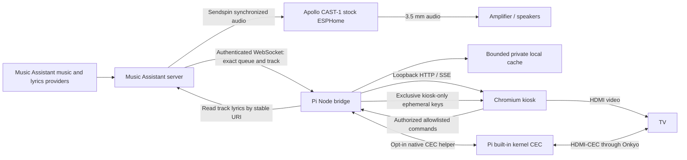
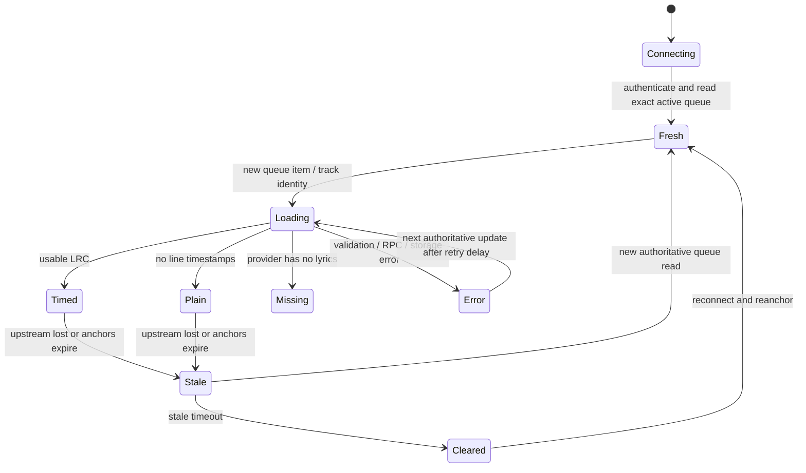

# Architecture

CAST-1 is an ESP32-S3 audio endpoint, **not Google Chromecast**, an HDMI display,
or a browser host. Leave its firmware unchanged. The Pi is a separate screen.
Neither the Pi bridge nor the browser joins a Sendspin audio group, registers an
audio player, emits audio, or changes Music Assistant/CAST playback.

## Synchronization contract

V1 uses Music Assistant queue elapsed-time anchors, not the Sendspin audio clock.
The UI explicitly labels this **approximate queue synchronization**. The bridge
selects exact configured player and queue IDs; titles are display-only and never
used to search for lyrics. The configured queue must be the active queue for the
target CAST (which may be a group queue). A mismatch freezes the display rather
than silently following another player.

If MA explicitly reports no active queue, the bridge can instead read the
configured player's external-source metadata, with the same configured group
owner constraint. Display occurrence identity is separate from catalog identity:
an AudioSource URI does not identify a song, and display text never initiates a
lyrics search. Missing exact identity yields an explicit unsupported-lyrics state
and cancels previous queue work. External player clocks are labelled separately.
See [Spotify Connect limitations](music-assistant.md#spotify-connect-and-external-sources).

`PlaybackClock` isolates the timing source. Its baseline implementation anchors a
millisecond position to `performance.now()` and advances only at speed 1.
Paused/stale/stopped clocks have speed 0. Explicit seek/repeat/next updates replace
anchors rather than smoothing away discontinuities. Track duration bounds the
clock. Browser clocks independently reanchor on snapshot receipt, using browser
monotonic time; machine wall clocks need not agree. The persisted visual offset
is added only by the renderer, never sent to MA: **positive offsets show lines
earlier**, negative offsets delay them.

Queue timestamps and WebSocket delivery are not DAC presentation timestamps.
Wi-Fi latency, server scheduling, queue-update granularity and audio buffering
all affect alignment. There is no guaranteed millisecond/word-level accuracy.
Calibrate an offset while listening to the CAST. Do not advertise this fallback
as Sendspin-synchronized karaoke. MA queue metadata does not provide a reliable
future presentation-time contract here, so transitions are applied on observed
authoritative queue changes, not guessed scheduled transitions.

## Data lifecycle

Every track change increments a generation and aborts in-flight work. Generation
checks remain necessary even when cancellation cannot stop already-running
provider work. Old responses cannot update a new track. Stop clears lyrics
immediately. Next-track preloading is opportunistic, based only on the queue's
actual next item, bounded to one request, and never guesses from title.

The lyrics transport implements `LyricsProvider`, separately from parsing and
timing. LRC accepts repeated timestamps, fractional seconds and `[offset:...]`,
orders lines stably, preserves blank lines and Unicode, and caps input size and
line count. Enhanced LRC word markers are stripped: the supported output is
line-level. Plain lyrics never masquerade as timed lyrics. Errors, missing
lyrics and unsupported capabilities are distinct.

Now Playing, Lyrics and Split are presentation modes over the same snapshot and
clock, not separate playback sessions. The mode and visual offset persist
through an authenticated partial settings update; concurrent updates merge
without discarding the other preference. All modes retain the same stale and
track-generation safeguards, including cancellation of superseded cover fetches.

Ambient is a separate persisted presentation choice, not another queue state.
Its selected image IDs, static/slideshow flag and dwell merge inside the same
settings write queue as calibration/layout. MA events and browser stale clearing
remove old song information without erasing Ambient preferences. A local timer
advances the selected collection independently of the playback clock. No physical
source detection, receiver switching, or audio player is involved.

Individually CC0-cleared built-in photographs are trusted local static assets,
with fixed author/source/license metadata and no runtime remote image feed.
Uploaded JPEG/PNG
inputs go through an authorized, bounded raster decoding/re-encoding path into a
private state directory. Only validated library IDs can be served, not arbitrary
state paths or user-provided upstream URLs. Image metadata is separate from
settings: removed image IDs are filtered from presentation rather than requiring
an unsafe multi-file settings/library transaction.

The cache keys exact stable provider URIs, not titles. In-memory access is LRU
bounded; disk retention is bounded by recent writes, with 24-hour positive and
five-minute missing-result TTLs. It is private local storage, not a lyrics
distribution service. Restart restores cache/settings, **not an old playback
position**. Playback always requires a fresh queue read.

## Wi-Fi failure behavior

The HTTP service starts without waiting for network readiness; locally bundled
UI/CSS/fonts and the explicit demo need no external service. MA uses capped,
jittered exponential reconnect backoff, transport heartbeat, RPC timeouts and
periodic target-queue reconciliation. A socket reconnection alone never resumes
the lyric clock; a successful queue read does.

Upstream disconnect freezes immediately. Even on an open socket, no authoritative
queue anchors for 15 seconds causes a stale state; after 45 seconds the track is
cleared. Independently, if the browser loses the bridge's one-second stream,
its own watchdog freezes then clears the view. Cache availability never excuses
showing old lyrics under an unrelated track.

## Hardware and trust boundaries

Backend and Chromium have different service lifecycles: systemd owns the
headless bridge; the graphical desktop session owns Chromium and HDMI.
CEC failure cannot stop lyrics rendering or CAST audio. CEC control is opt-in,
local-only and allowlisted; standby is unsupported. Native input and explicit
outbound commands share one exclusive adapter owner. Input uses a separate
authenticated kiosk lease/epoch, not playback snapshots or browser audio.
Normal administrator pages never register for input. See
[security](security.md), [deployment](deployment.md) and [CEC](cec.md).

Native standardized Sendspin lyrics are not a v1 dependency or implemented
transport. The draft specification, SDK support and MA integration are separate
gates. See [future integration](future-integration.md) and the pinned upstream
verification notes in [Music Assistant](music-assistant.md).
