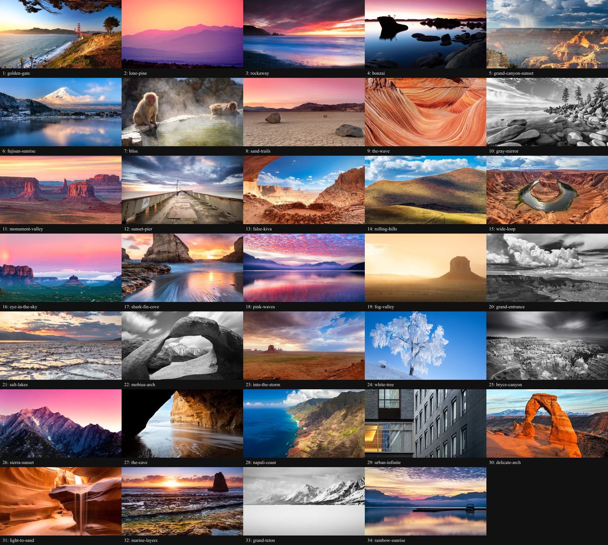
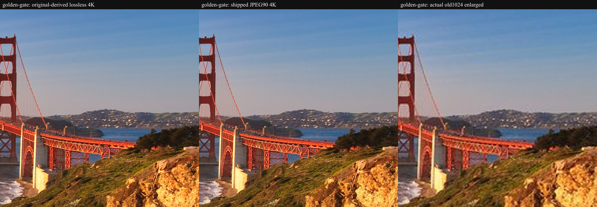

# Ambient photograph sources and permissions

The collection includes real photographs identified through
[dconnolly/chromecast-backgrounds](https://github.com/dconnolly/chromecast-backgrounds),
not generated illustrations. This display bundles **34 individually
rights-cleared native 4K photographs** by Romain Guy: the original four works
plus 30 more landscapes, nature and architecture photographs from his own
portfolio. **All 34 display files are 3840x2160; there are zero legacy
low-resolution built-ins.** The private upload library remains separate.
It is not affiliated with or endorsed by Google, Flickr, or the photographers.

## What the archive does and does not license

The reviewed archive revision is
[`ad63886779bb41f6d8e6defb364411cd36058d16`](https://github.com/dconnolly/chromecast-backgrounds/tree/ad63886779bb41f6d8e6defb364411cd36058d16).
Its `backgrounds.json` contains 702 URL records, 631 with an `author` field and
71 without. It does not provide individual photo-license or photographer-page
fields. The MIT license covers rights the repository author can grant; it is
**not evidence that all third-party photographs may be redistributed**.
An opt-in button or local caching would not fix missing photo permission.
The complete archive is therefore not downloaded, bundled, or offered as a feed.

## Included works

All evidence below was reviewed on **2026-09-05**. For each work, the
photographer's own page links the identified Flickr photo page. The fetched
Flickr page's `ImageObject` JSON-LD names Romain Guy as author/creator and gives
`https://creativecommons.org/publicdomain/zero/1.0/` as its `license`.
The `ImageObject.contentUrl` is only a 1024-pixel preview, **not the original**.
For this collection, each photo page's explicit `sizes.o` record supplied the
exact original JPEG URL and dimensions. No CDN suffix/secret was guessed.
Every downloaded original was decoded and matched against those dimensions
before cropping; original and final SHA-256 hashes are recorded.

The machine-readable [per-photo manifest](background-manifest.json) records
each stable ID, exact original URL, author, creator and licensed photo pages,
the extracted individual `ImageObject` license and original-size evidence,
source dimensions/bytes/hash, page hashes, review time, crop recipe, usable
native crop dimensions, and final/thumbnail dimensions/bytes/hashes.
Full source-page captures and original files are separate acquisition records,
not bundled release assets. The manifest preserves their recorded hashes and
extracted evidence; reproducing those historical hashes requires the matching
original records, not a newly fetched page.



| Work / individually licensed photo page | Original pixels | Photographer's page |
| --- | --- | --- |
| [Golden Gate Afternoon](https://www.flickr.com/photos/romainguy/3409068082/) | 5616x3351 | [Creator](https://www.curious-creature.com/posts/2020/golden-gate-afternoon/) |
| [Lone Pine Sunset](https://www.flickr.com/photos/romainguy/5910108497/) | 5276x3517 | [Creator](https://www.curious-creature.com/posts/2020/lone-pine-sunset/) |
| [Rockaway Sunset Sky](https://www.flickr.com/photos/romainguy/6249263074/) | 5426x3148 | [Creator](https://www.curious-creature.com/posts/2020/rockaway-sunset-sky/) |
| [Bonzai Rock Sunset](https://www.flickr.com/photos/romainguy/6899851215/) | 5545x3540 | [Creator](https://www.curious-creature.com/posts/2020/bonzai-rock/) |
| [Grand Canyon Sunset](https://www.flickr.com/photos/romainguy/55033232729/) | 11240x8431 | [Creator](https://www.curious-creature.com/posts/2026/grand-canyon-sunset/) |
| [Fuji-san Sunrise](https://www.flickr.com/photos/romainguy/54855857393/) | 11656x6556 | [Creator](https://www.curious-creature.com/posts/2025/fujisan-sunrise/) |
| [Bliss](https://www.flickr.com/photos/romainguy/54488185898/) | 11656x4302 | [Creator](https://www.curious-creature.com/posts/2025/bliss/) |
| [Sand Trails](https://www.flickr.com/photos/romainguy/45158181915/) | 5745x2404 | [Creator](https://www.curious-creature.com/posts/2024/sand-trails/) |
| [The Wave](https://www.flickr.com/photos/romainguy/52929227115/) | 8424x11232 | [Creator](https://www.curious-creature.com/posts/2023/the-wave/) |
| [Gray Lake](https://www.flickr.com/photos/romainguy/8440283318/) | 5430x3619 | [Creator](https://www.curious-creature.com/posts/2023/gray-mirror/) |
| [Monument Valley Sunset](https://www.flickr.com/photos/romainguy/44943115621/) | 5220x2936 | [Creator](https://www.curious-creature.com/posts/2022/monument-valley-sunset/) |
| [Sunset Pier](https://www.flickr.com/photos/romainguy/12280569835/) | 5976x3362 | [Creator](https://www.curious-creature.com/posts/2022/sunset-pier/) |
| [False Kiva](https://www.flickr.com/photos/romainguy/52433724895/) | 8688x5792 | [Creator](https://www.curious-creature.com/posts/2022/false-kiva/) |
| [Rolling Hills](https://www.flickr.com/photos/romainguy/52433501823/) | 10880x8160 | [Creator](https://www.curious-creature.com/posts/2022/rolling-hills/) |
| [Wide Loop](https://www.flickr.com/photos/romainguy/42597187025/) | 5948x3965 | [Creator](https://www.curious-creature.com/posts/2022/wide-loop/) |
| [Eye in the Sky](https://www.flickr.com/photos/romainguy/44465053515/) | 8688x3635 | [Creator](https://www.curious-creature.com/posts/2022/eye-in-the-sky/) |
| [Sharktooth](https://www.flickr.com/photos/romainguy/44322416190/) | 8256x6192 | [Creator](https://www.curious-creature.com/posts/2022/shark-fin-cove/) |
| [Pink Waves](https://www.flickr.com/photos/romainguy/46736410561/) | 5963x3354 | [Creator](https://www.curious-creature.com/posts/2022/pink-waves/) |
| [Fog Valley](https://www.flickr.com/photos/romainguy/19489500310/) | 8322x4682 | [Creator](https://www.curious-creature.com/posts/2021/fog-valley/) |
| [Grand Entrance](https://www.flickr.com/photos/romainguy/51411788263/) | 8365x5577 | [Creator](https://www.curious-creature.com/posts/2021/grand-entrance/) |
| [Salt Lakes II](https://www.flickr.com/photos/romainguy/51402831891/) | 5593x8390 | [Creator](https://www.curious-creature.com/posts/2021/salt-lakes/) |
| [Mobius Arch](https://www.flickr.com/photos/romainguy/9254611750/) | 5760x3840 | [Creator](https://www.curious-creature.com/posts/2021/mobius-arch/) |
| [Into the Storm](https://www.flickr.com/photos/romainguy/32450652070/) | 8688x4888 | [Creator](https://www.curious-creature.com/posts/2021/into-the-storm/) |
| [White Tree](https://www.flickr.com/photos/romainguy/16199195845/) | 4201x2806 | [Creator](https://www.curious-creature.com/posts/2020/white-tree/) |
| [Bryce Canyon](https://www.flickr.com/photos/romainguy/9296967879/) | 5760x3240 | [Creator](https://www.curious-creature.com/posts/2020/bryce-canyon/) |
| [Sierra Sunset](https://www.flickr.com/photos/romainguy/5911366388/) | 5616x3744 | [Creator](https://www.curious-creature.com/posts/2020/sierra-sunset/) |
| [The Cave](https://www.flickr.com/photos/romainguy/6934434271/) | 5464x3643 | [Creator](https://www.curious-creature.com/posts/2020/the-cave/) |
| [Napali Coast](https://www.flickr.com/photos/romainguy/6840341477/) | 5514x3676 | [Creator](https://www.curious-creature.com/posts/2020/napali-coast/) |
| [Urban Infinite](https://www.flickr.com/photos/romainguy/49616740326/) | 4829x7236 | [Creator](https://www.curious-creature.com/posts/2020/urban-infinite/) |
| [Delicate Arch](https://www.flickr.com/photos/romainguy/7010365913/) | 5154x3436 | [Creator](https://www.curious-creature.com/posts/2020/delicate-arch/) |
| [Light to Sand](https://www.flickr.com/photos/romainguy/8338439169/) | 5569x3713 | [Creator](https://www.curious-creature.com/posts/2020/light-to-sand/) |
| [Marine Layers](https://www.flickr.com/photos/romainguy/49376576473/) | 8256x5504 | [Creator](https://www.curious-creature.com/posts/2020/marine-layers/) |
| [Grand Teton](https://www.flickr.com/photos/romainguy/7926134090/) | 5448x3065 | [Creator](https://www.curious-creature.com/posts/2020/grand-teton/) |
| [Rainbow Sunrise](https://www.flickr.com/photos/romainguy/49324749913/) | 5984x3366 | [Creator](https://www.curious-creature.com/posts/2020/rainbow-sunrise/) |

**Permission:** [CC0 1.0 Universal](https://creativecommons.org/publicdomain/zero/1.0/)
([legal code](https://creativecommons.org/publicdomain/zero/1.0/legalcode.en)).
CC0 permits copying, modification and redistribution, including commercial
use, without a copyright-attribution condition. We nevertheless retain visible
photographer/source/license credits and this provenance. CC0 does not imply
endorsement or clear unrelated personality, privacy or trademark rights.

The old four bundled files were 1024x611, 1024x683, 1024x594 and 1024x654.
They are replaced by newly acquired originals of **the same photo identities**,
not interpolations of those preview files. Their `builtin-golden-gate`,
`builtin-lone-pine`, `builtin-rockaway` and `builtin-bonzai` IDs remain stable.
Versioned local asset URLs prevent a cached 1024-pixel copy masking the update.
Two other candidate originals were rejected because their widths were below
3840 pixels; repeated images or alternate crops are not used to pad the count.

## Processing, offline operation and privacy

The 34 bundled copies are auto-oriented, cropped to landscape **3840x2160**
and JPEG quality-90 encoded (4:2:0 chroma), with embedded EXIF/ICC/XMP stripped
and **no enlargement**. Every source has a usable 16:9 crop of at least
3840x2160, including the three portrait originals. Center crops are used
except Urban Infinite's reviewed bottom crop. Cropping is permitted by CC0;
these are display compositions, not lossless archives.

The full-size JPEGs occupy **60,091,049 bytes (57.31 MiB)**. The 34 independent
**480x270**, quality-78 JPEG library thumbnails occupy **801,541 bytes
(0.76 MiB)**, for **60,892,590 bytes (58.07 MiB)** of bundled photography.
Only the current/transitioning full-size scenes load (at most two image
elements); the library uses lazy small derivatives, never full-size scenes as
thumbnails. There is no all-collection full-resolution preload.
Credits live in the reviewed static catalog/UI and manifest, not discarded EXIF.

The acquisition review compared all 34 landscape crops in a contact sheet,
checked portrait/edge-sensitive compositions against originals, and compared
representative full-detail original-derived crops against the old 1024 files.
Long exposures, fog and intentionally shallow focus remain naturally soft:
native pixel dimensions are not a promise that every photographed surface is sharp.

**Golden Gate detail, at 640x640 pixels per crop:** left is a lossless 4K
downsample from the verified original, center is the shipped quality-90 JPEG,
right is the actual old 1024-pixel bundled image enlarged to the same display
size. Open the figure at full size to compare bridge cables and hillside detail.
The figure itself is lossless PNG, not a newly compressed comparison.



These local assets work on a fresh installation without Internet or MA.
There is **no runtime network photo import/cache**: no Google/Flickr call,
remote thumbnail, automatic redirect, or browser exposure of upstream image
URLs. Clicking a source/license link deliberately visits that external site;
ordinary slideshow operation does not. Internet remains necessary for initial
software/package acquisition, not to unlock a first Ambient photograph.

User uploads are separate, local, quota-bounded validated JPEG/PNG copies.
They survive updates under `STATE_DIR/ambient`; built-in photographs live in
the release's static assets and do not count toward the upload quota.
Add more built-ins only after individually checking their permissions and
provenance; do not expand this set based merely on public URL accessibility.

## Maintainer rebuild and updates

`scripts/build-backgrounds.mjs` is an **offline maintainer tool**, not a runtime
download path. With the lockfile's Sharp version installed, supply a private
directory containing the manifest's verified originals named by ID suffix
(for example `golden-gate.jpg`):

```sh
node scripts/build-backgrounds.mjs /private/path/to/verified-originals
```

It checks original hashes/dimensions, forbids enlargement, rebuilds both local
derivatives and the shared catalog, and checks their recorded hashes. A changed
Sharp encoder may produce different hashes: review any deliberate re-encoding
and update provenance rather than bypassing the check. New works first require
an individual creator-to-photo identity check, suitable redistribution/cropping
permission, explicit original download metadata, and native-size confirmation.
Do not run this tool against personal uploads or commit the source directory.
This offline build permits up to 160 million input pixels for the reviewed
large originals; that is **not** the runtime upload policy. Browser uploads
remain limited to 12 MiB / 32 million pixels with supervised decode deadlines.

Installation/update remains the ordinary [source-commit update from main](upgrading.md)
**after the photo change has merged**; no unmerged feature-branch default or
extra image-download command is needed. Stored selections and uploads survive.
Old uploaded 1080p canonical copies cannot regain discarded pixels: re-upload
the original to obtain a new higher-resolution display copy.
