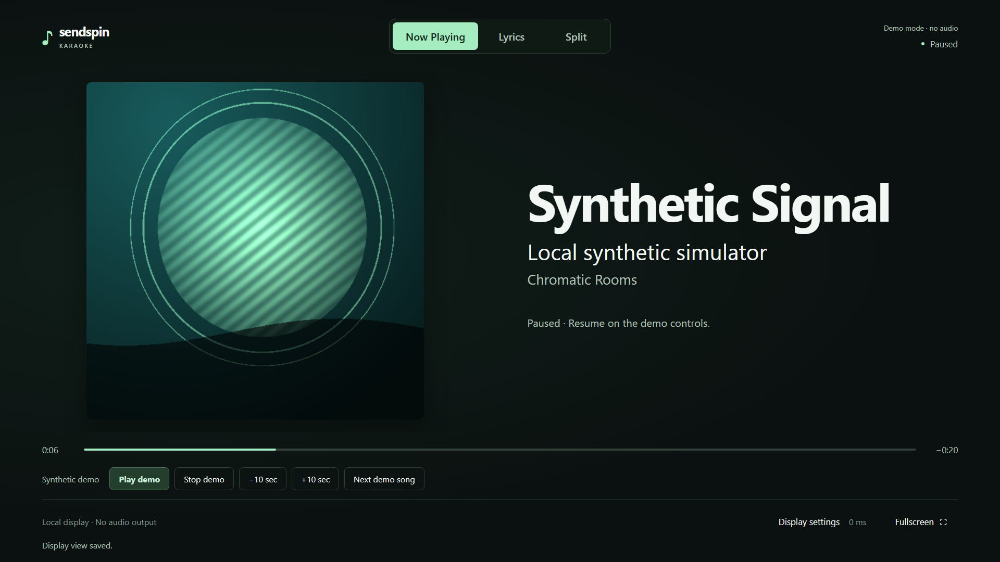
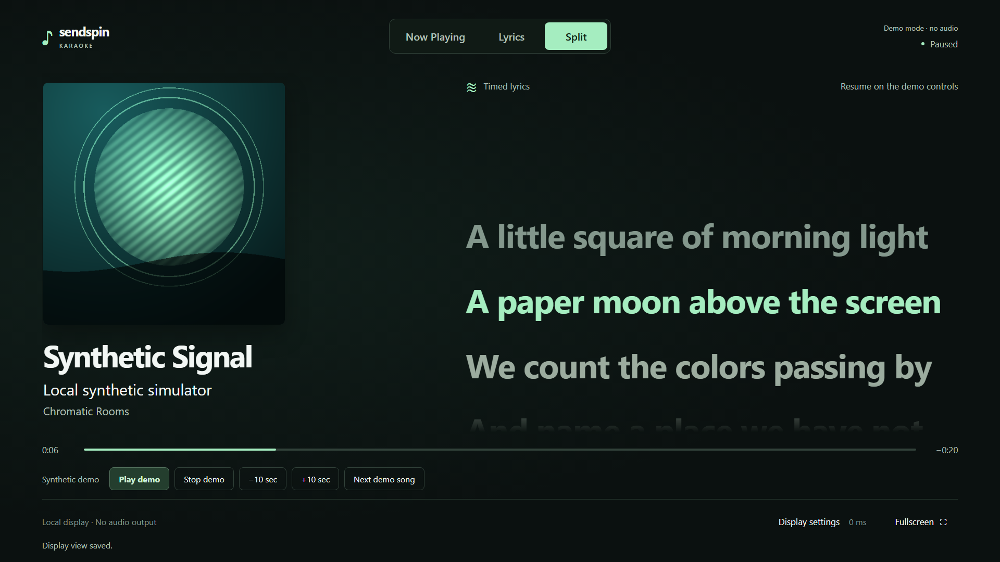
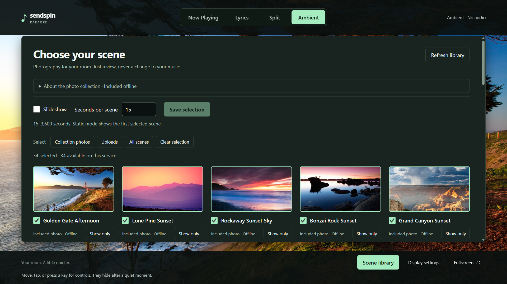
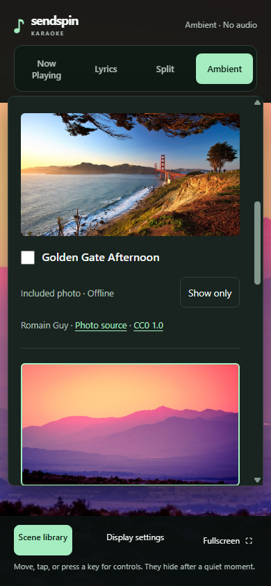

# Music and Ambient display

The TV interface is an original music-player-inspired design, not a Spotify
client or a reproduction of Spotify branding. It does not sign in to Spotify,
create a Spotify library, play audio on the Pi, or add Music Assistant write permissions.
The CAST remains the audio endpoint; the Pi remains the screen.

## Choose your view

| View | Best for |
| --- | --- |
| **Now Playing** | Prominent album cover, readable title/artist/album, playback status, elapsed and remaining time |
| **Lyrics** | Large line-synchronized text, with compact artwork and track context |
| **Split** | Album artwork and lyrics together; the default for a fresh installation |
| **Ambient** | Real landscape photographs or your images while listening to records, CDs, or any other source |
| **Vinyl** | Saved, cover-first line-in presentation with optional tracklist, passive meters and quiet controls |
| **Line-in album** | Optional, independently identified album context from this Pi's analogue input; no current-track claim or lyric clock |

Select a normal view using the visible mode selector. The choice is saved on the
backend in the same protected `settings.json` as the visual offset. It survives
reloads, track changes and service/Pi restarts. Changing the view does not reset
your offset, seek the music, or automatically change when a track has no lyrics.
Older offset-only settings files migrate automatically to Split.
The optional **Line-in album** view is the exception: it is temporary, does
not change the saved normal view, and returns to that normal view on reload.

## Optional Line-in album view

The [optional ShazamIO setup](uca222-source.md#optional-album-identification-behavior-and-limits)
adds a separate album-identification view. It never automatically replaces
normal Music Assistant playback or Ambient. Select **Line-in album** explicitly
to view the album inferred from the Pi's source input; the view is independent
of the configured MA player's queue and can also be used during local recording.
It is not proof that a particular speaker is currently playing that input.

Identification makes one automatic attempt per audible session and rearms after
five continuous seconds of silence. The last identified album stays visible
during a side flip, a failed match or a service/Pi restart, until a new album is
identified. The live status remains separate from this cached album: a displayed
cover is not evidence that recognition is currently active or that the same
record is still playing.
A wide-screen layout places the cover on the left and the catalog tracklist
on the right, with scrolling for albums that do not fit on screen. Narrow
screens stack the sections. Disc and track numbers describe the matched
catalog edition, not the physical vinyl sides or the current playback position.
The title and action buttons keep separate, bounded space. Catalog status,
metadata retry and provider information appear below the cover and tracklist;
scroll the album page to reach them. Long titles and notices extend the page
instead of collapsing the artwork or tracklist.
If a complete catalog tracklist cannot be resolved, the view reports that
instead of substituting a different album or silently truncating the list.
An unsuccessful attempt leaves the cached album unchanged. **Retry identification**
requests a fresh sample while recognition is enabled and line-in capture is
active; it does not enable recognition, start capture or start recording.
There are no automatic retries within the same session. Album metadata
is inferred and can refer to a single, compilation or reissue instead of the
physical record. No recognized song lyrics, progress bar or synchronized lyrics
are supplied by this view. Return to the normal views for MA track metadata and
lyrics; selecting this view does not start capture, streaming or recording.
The source supplies the detected track's artist as context, not a separately
verified album-artist credit. Identification needs a 12-second sample and
network processing time. The view reports sampling, identification, unavailable
and offline states alongside the last identified album, if one is cached.

Use **Correct album edition** to search, preview and confirm a replacement
catalog edition. The displayed title, cover and tracklist change together;
the original recognition stays separate. The same action is available under
**Vinyl > Line-in details**. See [journal and edition correction](journal-and-editions.md)
for remembered mappings, current-identification-only limits and privacy.

## Source tools and Vinyl

The [Vinyl view](vinyl-mode.md) keeps the last album prominent and saves its
tracklist and meter toggles. It never selects itself in response to audio.
Its live source status remains separate from cached album context.

Open **Tools** from any view for passive stereo **Meters**, completed
**Recordings**, **Health** and the 90-day **Journal**. Opening tools keeps
idle-fading controls awake. The [recordings library](source-tools.md#completed-recordings)
renames display/download labels without changing audio, and album attachments
require explicit confirmation. [Health](source-tools.md#health-and-diagnostic-export)
offers a sanitized diagnostic download. These controls do not start capture,
recording or recognition, or expose the application beyond its local interface.

## Low-cost lyric follow at 4K

After upgrading, open **Display settings > Lyric follow > Instant (low-cost)**.
This control is available in the normal music views and Ambient, using the TV remote
or the normal admin browser through the SSH tunnel described below. The setting
is saved on the service and applies to every connected display, including the
TV, without a physical mouse or a kiosk restart.

**Smooth remains the default**, including for older settings files. An upgrade
alone does not select Instant. Instant centers the current cue in a single
scroll operation, with no animated travel, lyric color fades, fade-edge mask,
or changing active font weight. The active cue keeps its accent color.
Reduced-motion preferences use this same low-cost rendering even when Smooth
is selected, and changes to that preference take effect immediately.
This does not alter the lyric clock, visual offset, audio, native 4K photos,
photo transitions, or HDMI output resolution.

All timed lyrics remain available for reading, copying and assistive technology.
Focus, wheel, touch, or click the timed pane (or select **Pause lyric follow**)
to pause automatic following. Up/Down, including held remote keys, scrolls the
focused pane; Left/Right leaves it. Cues, seeks and resizes do not pull the pane
away while reading. **Resume lyric follow** centers the latest cue once using
the selected mode. A new track/generation or leaving the lyric view resets the
local reading pause. Plain unsynchronized lyrics remain manually scrollable.
Reading pause is local to that browser; it does not pause playback or change
the saved follow setting.

The shared header keeps the focus on view navigation and connection status
rather than a project wordmark. Track information,
album artwork, settings, and accessible navigation labels are retained.

## Ambient: a quiet screen for any music

Select **Ambient** deliberately. It stays selected across MA queue changes,
disconnections, browser reloads, and service restarts. The mode never starts
audio or guesses what is playing on a physical source. Return using **Now
Playing**, **Lyrics**, or **Split**; nothing switches back automatically.
MA readiness and reconnection still reflect the real queue, not Ambient activity.

The bundled collection contains **34 native 4K photographs by Romain Guy**,
including original-resolution replacements of **Golden Gate Afternoon**,
**Lone Pine Sunset**, **Rockaway Sunset Sky**, and **Bonzai Rock Sunset** from
the [Chromecast archive](https://github.com/dconnolly/Chromecast-Backgrounds),
plus 30 more nature, landscape and architecture photographs from his portfolio.
Every bundled scene is **3840x2160**, cropped from a verified full-size original
without upscaling; there are **zero low-resolution legacy built-ins**.
These works have individually verified **CC0 1.0** permissions. This is a
rights-cleared subset, **not all 702 archive entries**; the archive's MIT code
license is not a blanket photo license. Photographer/source/license credits
are available in the library and [the provenance guide](background-credits.md).

All 34 photographs (58.07 MiB including small thumbnails) are bundled locally and work on first launch without MA,
Internet, consent dialogs, or an online image cache. The app does not contact
Google/Flickr for backgrounds at runtime or accept arbitrary image URLs.
The checked old archive CDN links for the first two works returned 404; the bundled copies
come from the photographer-linked, CC0-marked source pages instead.
Fresh installations include all 34, with a **60-second slideshow**.
Existing saved selections are unchanged, including the four stable original
photo IDs. Open Scene library to include the additional photos deliberately.
In the background library, include/exclude
images or show just one, choose static or slideshow, and save a dwell time
from **15 to 3,600 seconds**. The selection, dwell, and slideshow preference
are saved separately from lyric calibration.

Controls fade away after inactivity; keyboard, touch, or pointer activity brings
them back. **Escape** returns to controls and closes an open editor. Controls
stay visible while editing or uploading. A keyboard-emulating remote can select
a view or open the library without a mouse. Reduced-motion preferences remove
scene transitions, not your deliberate slideshow choice. Static mode is available
for no changes at all. Keep the TV's burn-in and power policy in mind.

### Add your own images

Use a normal browser on the Pi, or open the existing SSH tunnel from your
computer (replace the login/hostname):

```sh
ssh -N -L 127.0.0.1:8787:127.0.0.1:8787 your-user@karaoke-pi.local
```

Browse **http://127.0.0.1:8787** without `?kiosk=1`, choose **Ambient**, open
the background library, and use its file chooser. You still have a normal
pointer in this browser. If the local port is occupied, forward local 8788
to Pi 8787 instead and browse `http://127.0.0.1:8788`. Do not expose the app
on the LAN or make the tunnel public.

Only **JPEG and PNG** uploads are accepted. Each input is limited to
**12 MiB**, **32 million decoded pixels**, and **16,384 pixels on either
axis**. Animated/multipage files, SVG, GIF, WebP, HEIC, HTML, corrupt images,
and mismatched types are rejected. Export unsupported photos as JPEG or PNG
first. The server fully decodes accepted images, applies orientation, resizes
inside **3840x2160** without enlargement, strips embedded EXIF/GPS and other
metadata, and saves a quality-85 canonical JPEG. Transparency is flattened onto
dark slate (`#171b21`); this is a
display copy, not an archive of the original. Canonical output remains capped
at **8 MiB**, with an 8-second native decode deadline inside a killable
10-second supervised worker. Portrait or 3:2 uploads fit inside the bounds,
so not every upload has enough pixels for a native full-screen 16:9 4K crop.
Old uploaded 1080p copies are retained unchanged; **re-upload the original**
for higher detail. The server cannot recover pixels discarded by an old upload.
If the original exceeds the input limits, export a smaller JPEG/PNG that still
retains the desired 4K pixels before uploading; the limits are not bypassed.

The library permits **40 uploaded images** and **128 MiB** of stored display
copies and their thumbnails. Built-ins do not count. Work is bounded; a busy/full/error response is
not a successful upload. Only the currently displayed/transitioning scenes
and lazy library thumbnails load, rather than all full-size images at once.
Upload previews are generated only when requested, one isolated decode at a
time, at up to **480x270 / 256 KiB** without enlargement. Existing v1 libraries
need no startup regeneration: optional derivative metadata is saved lazily.
Scene reads/deletion are not held behind thumbnail decoding. If a preview
fails, the card shows **Preview unavailable** and **Retry preview**, never a
full-size image fallback. If storage is full, delete unwanted uploads to make
space, then retry; use Refresh library when working with an older service.

### Getting the full 4K detail

A 4K photo does not change the Pi's output mode. Full detail requires the Pi
desktop and HDMI output through the receiver to be **3840x2160**, with suitable
TV scaling/overscan and browser zoom. A 1920x1080 desktop still outputs 1080p,
even on a 4K television. The app does not change desktop, HDMI or CEC settings.
For jerky lyric scrolling on the Pi 4, select **Instant (low-cost)** rather than
lowering the desktop resolution. The native 4K photos stay unchanged.
Natural fog, long-exposure water and shallow focus are not
compression defects. Actual Pi/receiver/TV resolution and smoothness require
hardware review; desktop Chrome screenshots are not physical Pi qualification.

Choose uploaded images for deletion and explicitly confirm. Built-ins cannot
be deleted. Removing a currently shown image selects the first remaining
included image; if none remain, Golden Gate Afternoon is the clearly identified fallback.
Deleted IDs are ignored in saved selections until the next selection edit.
Other open browsers refresh the library periodically or when it is opened.
If a deletion reports that library removal succeeded but file cleanup failed,
refresh the library and restart the service to finish recovery; do not assume
the image is still selected. Leftover files count toward quota until cleaned.

Uploads stay on this appliance under **`STATE_DIR/ambient`** (normally
`/var/lib/sendspin-karaoke/ambient`), never under a versioned release.
The settings file and library survive updates and restarts. Use the
[main-based upgrade and private backup guide](upgrading.md); back up the entire
state directory with the service stopped.
Do not edit library metadata or copy arbitrary files into its private directory.
The source filename is only a sanitized display title, not a storage path.
Images and titles are private local media: metadata stripping does not remove
visible personal information. Protect access and backups; deletion is not secure
erasure and does not remove old backups or browser caches.

Plain lyrics are explicitly marked unsynchronized and remain scrollable.
Missing/error/unsupported lyrics retain a useful cover and metadata experience
in Now Playing or Split. A deliberate artwork placeholder is shown when MA has
no usable cover or a cover request fails. Track changes replace the previous
cover immediately; stale image requests are cancelled and cannot populate the
next track. Updated artwork on the same track gets a versioned local URL.

The playback timeline is a read-only indicator in live mode. Pause is a visible
state; use Music Assistant to control real audio. There are no decorative,
non-functional shuffle, repeat, volume, or seek controls. Only the **explicit
synthetic demo** offers local playback buttons.

## Couch-friendly controls

For jerky scrolling or brief freezes (rather than late cues), see the
[scrolling modes, profiling method and Pi checks](scrolling-performance.md).
Unchanged snapshots no longer repeat timed-line rendering/follow requests;
resize and wrapping still recenter the current cue. This does not alter the
lyric clock or visual offset, and is not a claim of physical Pi qualification.

Buttons have large targets and a high-contrast keyboard focus ring. Tab and
Shift+Tab move focus; Enter/Space activate focused controls. The view selector
also supports directional navigation. Existing shortcuts remain available:
**F** toggles fullscreen, **[ / ]** shifts lyric timing by 100 ms, and **Escape**
closes display settings. From the page background, **1 / 2 / 3** selects Now
Playing / Lyrics / Split; **4** selects Ambient. Editable and scrollable content retains its normal
input behavior. A remote that acts as a keyboard can use these controls;
Up/Down scrolls focused metadata, timed or plain lyrics, and Left/Right leaves that
pane to reach other controls. [Opt-in native LG CEC input](cec.md) calls the same
real focus, activation and Back actions, without synthetic keyboard events.
Only the explicit kiosk URL acquires remote input; normal/admin tabs stay unaffected.
The first key while Ambient controls are hidden reveals them and focuses the
current view tab only. Release and press again to navigate or activate.
OK/Back do not repeat while held. Use the admin browser to select upload files;
native file dialogs cannot be driven by application remote events.

### Kiosk-only pointer hiding

The installed launcher opens **`http://127.0.0.1:8787/?kiosk=1`**. A small
local boot script and stylesheet hide the pointer across the page, including
buttons and editors, before React renders and again on reload. Keyboard focus
rings and touch remain available. Normal/admin/tunnel URLs without this flag
keep their pointer, even in browser fullscreen.

This is page-scoped, not a labwc desktop setting. No X11 `unclutter`, global
pointer change, or Chromium sandbox bypass is used. The OS desktop, browser
native file picker, and pre-page startup/error surfaces are outside the web
page's control and may show a pointer. Actual Wayland/Pi boot behavior still
requires hardware qualification.

For a stationary native cursor at the screen edge, the separate
[opt-in labwc startup workaround](kiosk-pointer.md#opt-in-to-native-startup-hiding)
supports stock Pi merged (`-m`) configuration. Unlike page CSS, this temporarily
hides the whole seat cursor until pointer activity; read the tradeoff and
requirements before enabling it. Ordinary install/update never enables it.

After upgrading an older launcher, **log out and back into the desktop once**
to restart it with the new URL. For ordinary UI updates, reload the browser.
Merely closing Chromium causes the
old running launcher's respawn loop to reopen it. The existing managed
`/bin/bash /opt/sendspin-karaoke/current/kiosk.sh &` autostart block is unchanged:
**no need to rerun `configure-kiosk.sh`** if that block is already installed.

View selection and TV settings remain useful when MA is reconnecting but the
local bridge is reachable. The existing Wi-Fi freeze/clear policy still applies
to track metadata, cover art, lyrics and time: stale playback must not pretend
to be live. Approximate MA queue synchronization is labelled unobtrusively;
changing view does not improve its physical timing precision.

## Visuals and performance

All fonts, styles and imagery used by the demo are local. Production album
covers come only through the bounded same-origin MA raster proxy. No upstream
image URLs or tokens are sent to the browser. The background uses lightweight,
static CSS gradients, not cover-color extraction, canvas/WebGL or animated blur.
Reduced-motion preferences disable decorative transitions and smooth scrolling.

The demo's jade and amber covers are original geometric PNGs generated from
`src/server/demo-artwork.ts` and cached locally in process memory. They are not
commercial album covers or a sign that a real music provider is connected.
Demo track names and lyrics are synthetic. The no-cover demo track deliberately
exercises the fallback state.

Browser review targets include 1920x1080, 1280x720, a smaller responsive viewport,
and native 3840x2160 Ambient scenes.
Physical readability, overscan, remote mapping and GPU behavior still need
qualification on the actual Pi and TV. See [Pi deployment](deployment.md).

### Native 4K browser evidence

`tests/ambient-browser.mjs` runs the production UI in real Chrome against an
isolated synthetic local HTTP/SSE/settings fixture. Build first, then run
`node tests/ambient-browser.mjs /path/to/private/artifacts` (set `CHROME_PATH`
if needed). It does not connect to MA or CEC. On 2026-09-05, Chrome
153.0.8010.27 on Windows passed all four resolution/throttle combinations:

| Viewport / CDP CPU throttle | Static main-thread busy | Library open + scroll | Slideshow |
| --- | --- | --- | --- |
| 1920x1080 / 1x | 1.45% | 2.81% | 1.63% |
| 1920x1080 / 4x | 11.08% | 19.87% | 10.97% |
| 3840x2160 / 1x | 1.47% | 2.64% | 1.63% |
| 3840x2160 / 4x | 10.38% | 18.13% | 11.48% |

Every run decoded 34 distinct 480x270 library previews, with **zero
library-triggered full-size requests**, zero external page requests, at most
two scene image elements, real 15-second slideshow timing, and one scene/no
transition under reduced motion. Injected thumbnail HTTP 404s and a failed
retry remained explicit; the next retry recovered the small preview without
ever requesting its full-size scene.

The 4K/1x library sample was **6.77 MiB JS heap / 1,050 DOM nodes**. A separate
read-only sample of that Chrome instance's explicit process IDs measured
**695.95 MiB summed working set / 635.95 MiB private committed bytes**.
Heap is not image/GPU/native memory; summed working sets can double-count shared
pages, and private committed bytes are not private resident memory. These are
point samples, not memory caps or long-duration leak measurements.
Busy percentages are renderer-main-thread task time, not whole-system CPU,
and include instrumentation/screenshot work. CDP throttling is **not Pi
emulation**. Native decoder concurrency is covered separately by backend
regressions; the synthetic browser fixture does not qualify that backend or
the physical Pi/labwc/HDMI/Onkyo/LG path.

## Screenshots

The music-view captures show the original synthetic demo at 1920x1080, paused for
capture. Some captures predate the Music Assistant Display name and retain an
older project wordmark; the current header is unbranded. No commercial album
covers, provider credentials or real listening
history are included. The same UI was reviewed at 1280x720 and 390x844;
smaller screens use normal vertical scrolling instead of clipping controls.

**Now Playing**



**Split**



**Ambient: native 3840x2160 Golden Gate Afternoon, controls hidden**


**Private scene library**



**Normal-browser mobile administration**



The 4K scene and 34-photo library captures above come from the current isolated
Chrome fixture described above. The mobile capture is from the earlier
four-photo release. Earlier browser checks also covered
1280x720, kiosk and plain-URL cursor styles (including the file-selector button),
keyboard focus/idle reactivation, reduced motion, slideshow/static settings,
uploads, confirmed deletion, and return to music. A separate explicitly
disconnected synthetic fixture confirmed that a saved upload survives service
restart and stale clearing while `/readyz` remains 503. These are software
checks, not qualification of Pi boot, labwc, HDMI/CEC, or the receiver.
